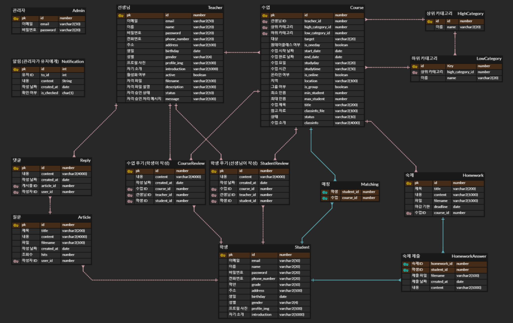

# :sunny: OnTeacher


코로나와 사교육 양극화에 시달리는 저소득층 학생들이 교육을 받기 어려운 상황에도 **교육 봉사 서비스**를 받을 수 있도록, **학생과 봉사자를 매칭**하여 온라인, 오프라인으로 꾸준하고 다양한 **학업 지도를 보조**하는 플랫폼


## :trophy: 수상

### 팀 부문​

:2nd_place_medal: 프로젝트 우수상

### 개인 부문

:1st_place_medal: 최우수상(이경민)

:2nd_place_medal: 우수상(정민아)

:medal_sports: 모범상(김다니엘)


## :pushpin: 목차

1. 불사조 팀
   1. 팀원 소개
   2. 팀 규칙 및 협업 방식
2. 프로젝트 개요
   1. 주요 기능
   2. 기술 스택
   3. 설계도
3. 주요 화면


## :bird: 불사조 팀

| 팀원                    | 역할                                               |
| ----------------------- | -------------------------------------------------- |
| 강면수 :muscle:         | Back-end, 배포                                     |
| 김다니엘 :zzz:          | **팀장**(Project manager), Full-stack, 발표        |
| 백승빈 :headphones:     | Back-end                                           |
| 안지우 :woman_cook:     | Full-stack, 발표                                   |
| 이경민 :hatching_chick: | Full-stack, Git 관리, DB 관리                      |
| 이범기 :turtle:         | Full-stack, 발표                                   |
| 정민아 :cat:            | Full-stack (Front-end 총괄), Git 관리, 회의록 작성 |

### :alarm_clock: 미팅

- 9:20 **데일리 스크럼** - `오늘 할 일` 브리핑, 이슈 논의
- 17:00 **회고** : `오늘 한 일` 브리핑, 코드 리뷰

### :pencil2: ​[노션](https://www.notion.so/829c650c0b2f4b3bae5e17f5b99fda88)

- 일정 관리
- 회의록 작성
- 진행 상황 공유 및 업무 관리
- 참고 사이트, 파일 등 문서 공유

### :file_folder: Git Convention

[자세히 보기](./docs/git.md)

#### Commit Message

> commit message는 이렇게 남겨요

```
type : title
body
```

#### Branch

> 기능별로 브랜치를 만들어 개발하고, 오류 확인 후 develop에 merge해요

```
feature/기능이름
```


## :mag: 주요 기능

1. 매칭
   - 선생님은 `수업 등록`을, 학생은 `수업 검색` 후 `수업 신청`을 통해 서로에게 적합한 교육 봉사 대상을 매칭할 수 있음
2. 수업 관리
   - 매칭된 선생님과 학생은 `수업 관리` 메뉴를 통해 내 수업을 관리할 수 있고 수업 진행을 보조 받을 수 있음
   - 선생님 : 수업 시작/연장/취소, 매칭 선택/취소, 과제 출제 및 확인, 후기 작성
   - 학생 : 수업 신청 취소, 과제 제출, 후기 작성
3. 질문 게시판
   - 학생이 자유롭게 질문할 수 있는 공간
   - 선생님이 답변을 남길 수 있음
4. OCR 인식
   - 네이버 Clova API의 OCR(글자 인식 AI 기술) 활용
   - 문서의 내용을 사진 찍어 텍스트로 추출 :point_right: 질문 게시판과 과제 등의 서비스에서 활용 가능


## :books: 기술 스택

> 프로젝트에 사용한 기술 목록과 버전이에요


     


## :clipboard: 설계도

> 본격적인 개발 전, 기획과 설계 단계에서 아래의 설계도를 제작하며 프로젝트의 구조와 흐름을 구체화했어요

### Wireframe

### ERD



### Class Diagram


### System Architecture


## :bulb: 주요 화면

