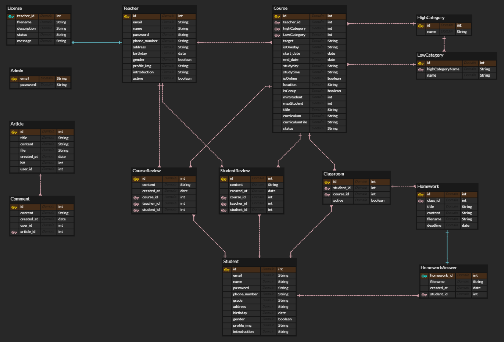
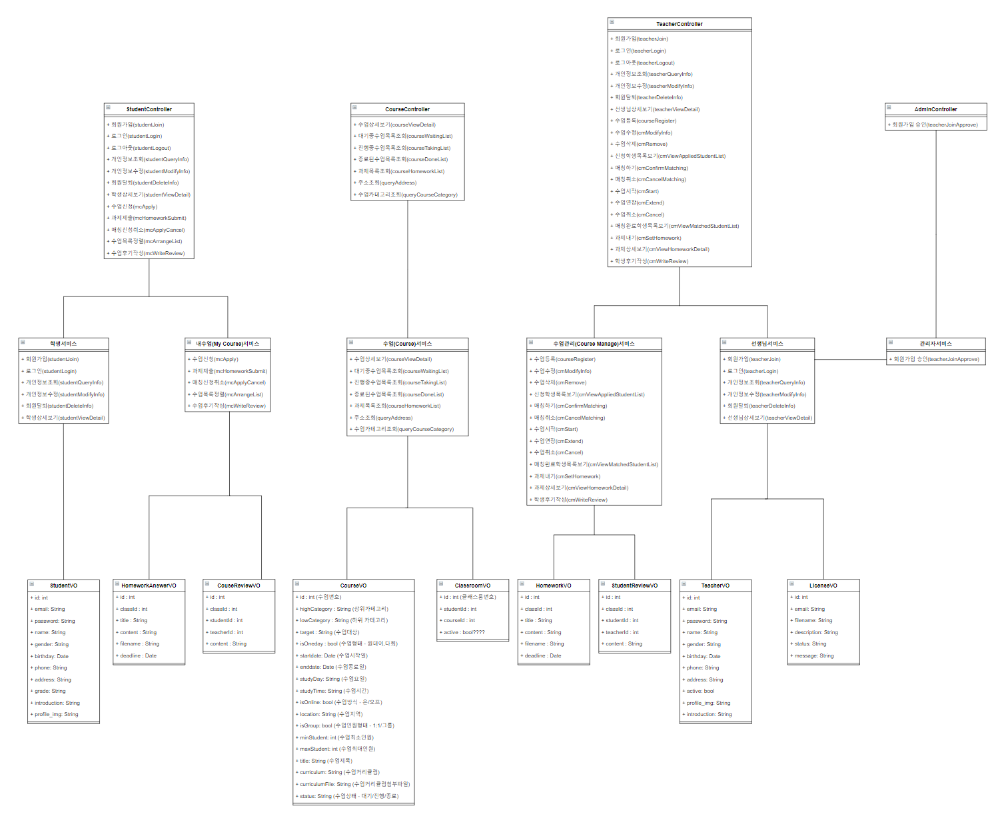

# :sunny: OnTeacher 

## :bird: 불사조팀

| 팀원     | 담당        |
| -------- | ----------- |
| 강면수   |             |
| 김다니엘 | **팀장**    |
| 백승빈   |             |
| 안지우   |             |
| 이경민   |             |
| 이범기   |             |
| 정민아   | 회의록 작성 |

### [노션](https://www.notion.so/829c650c0b2f4b3bae5e17f5b99fda88)

- 일정 관리
- 회의록
- 사이트, 파일 등 공유


## :books: 기술 스택

> 프로젝트에 사용한 기술 목록과 버전이에요


     


## :clipboard: 설계도

> 본격적인 개발 전, 기획과 설계 단계에서 아래의 설계도를 제작하며 프로젝트의 구조와 흐름을 구체화했어요

### Wireframe

### ERD



### Class Diagram



### System Architecture


## :file_folder: Git Convention

[자세히 보기](./docs/git.md)

### Commit Message

> commit message는 이렇게 남겨요

```
type : title
body
```

### Branch

> 기능별로 브랜치를 만들어 개발하고, 오류 확인 후 develop에 merge해요

```
feature/기능이름
```


