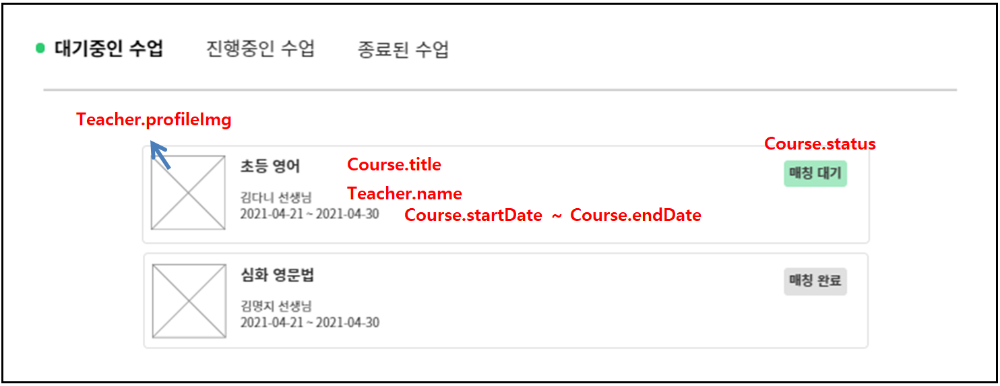
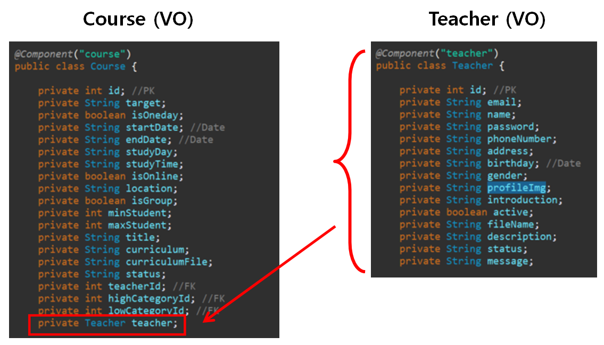
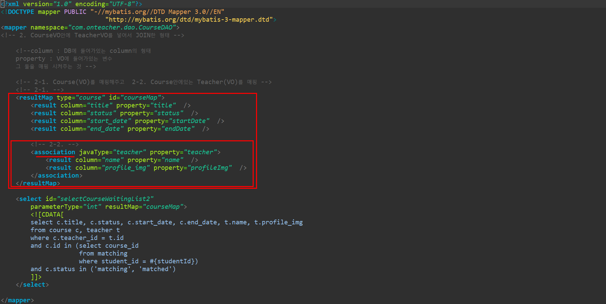
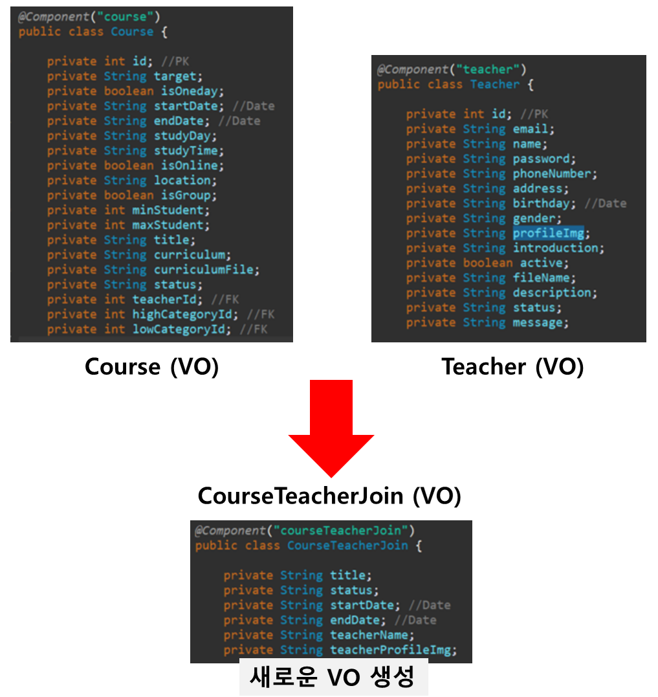
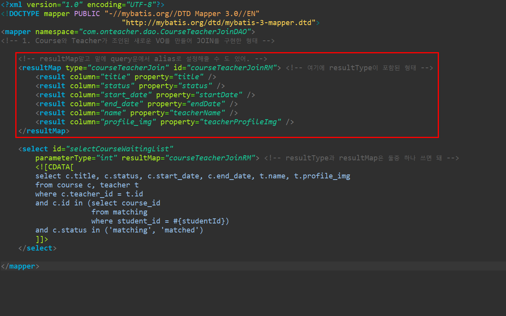

# MyBatis에서 JOIN 구현하는 방법

- 두 테이블의 일치하는 속성으로 조인하는 일반적인 조인의 경우는 조인을 하지않고 쿼리문을 나눠 구현을 하는 것을 지향한다. 조인을 하면 성능(속도)가 크게 감소하기 때문이다. 그럼에도 조인을 해서 구현하고 싶은 경우, 조인해야하는 경우(둘간의 일치하는 column이 없는경우, 특수) 아래 설명을 참고한다.

## 구성

1. 예시 상황

2. 구현 방법 

   2-1. 한 VO가 다른 VO를 인자로 갖도록 구현(=Map방식)

   2-2. 새로운 VO를 만들어서 구현(=VO방식)

3. 결론, 무엇이 더 나은가

### 1. 예시 상황

------

대기중인 수업을 조회하기 위해 Course테이블과 Teacher테이블 양쪽의 데이터를 조인하여 활용해야하는 상황. 

**Course 테이블** : title, status, start_date, end_date 

**Teacher 테이블** : name, profile_Img

위와 같은 column을 활용하여 데이터를 가져와.

### 2. 구현 방법

------

#### 2-1. 한 VO가 다른 VO를 멤버 변수로 갖도록 구현 (=Map 방식)

데이터가 더 많이 포함되고 중심이 되는 VO에 JOIN할 다른 VO를 멤버 변수로 갖고도록 한다.

resultMap에서 중심이 되는 Course VO에 대해 매핑하고, Teacher VO와 관계가 1:1일 경우 association, 1:N (course:teacher)일 경우 collection으로 구현한다. 

**여기에서 관계를 엄밀히 따지면 N:1(course:teacher) 이지만 ERD 설계상 Course안에 Teacher의 정보를 넣기로 했기에 1:1을 적용한다.*

참고 사이트

http://blog.naver.com/PostView.nhn?blogId=p952973&logNo=220986301342&redirect=Dlog&widgetTypeCall=true 

https://suhun918.tistory.com/15  => resultMap에서 관계설정 X

#### 2-2. 새로운 VO를 만들어서 구현 (=VO 방식)

각 VO에서 필요한 데이터들만 가지고 새로운 VO를 만든다.

DB의 column과 VO의 property 매핑을 잘 시켜주면 된다.

resultMap의 column은 DB에서 쿼리문을 던졌을때 column으로 보이는 이름이고 property는 java의 VO 클래스에서 선언해둔 멤버변수의 이름이다.

### 3. 결론, 무엇이 더 나은가

------

- 첫번째, Map 방식

장점 : 새로운 VO를 만들 필요가 없다

단점 : Join이 이리저리 많이 하다보면 한 테이블에 여러 테이블들이 덕지덕지 붙는 형태가 된다.

- 두번째 , VO 방식

장점 : 기능을 명확히 구분할 수 있다. 성능(속도)가 더 좋다.

단점 : 조인될때마다 새로운 VO를 만들어줘야한다

**결론**

> 실무에서도 상황에따라 개발자의 개발습성에 따라 갈린다고 한다. 정확히 언제는 첫번째를 쓰고 언제는 두번째를 쓰라고 정의내리기에는 지식, 경험적으로 부족하고 전문가들의 의견도 갈리기에 이번 프로젝트에선 **첫번째 Map 방식으로 통일**하여 개발 통합성 향상을 지향한다.

참고 사이트

https://okky.kr/article/211064