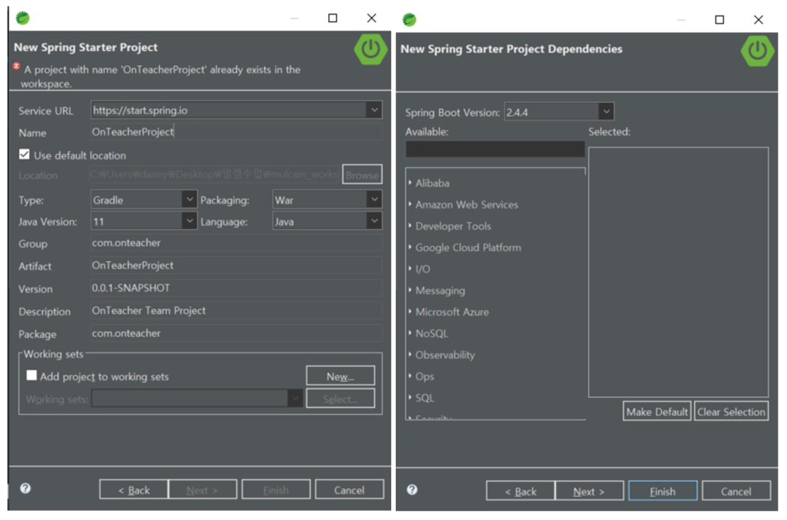
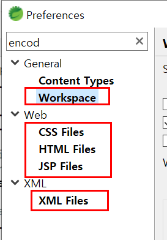

# OnTeacher 프로젝트 설명서

### 1. 프로젝트 생성

------

패키지 구조와 환경 설정은 가장 마지막으로 실습한 'BankBoot' 프로젝트를 모방함

개발시 BankBoot를 데모코드로 참고

[BankBoot.zip](https://drive.google.com/file/d/1ZLH9jtT3V0Ok6gyNjKASjsUcX8-KxewF/view?usp=sharing) 다운로드

### 2. 각 패키지 구성

------

**핵심기능 서비스** : 가장 먼저 우선순위를 두고 개발하기로한 서비스로 'Admin, Course, CourseManage, MyCourse, Student, Teacher'가 해당됨 ([클래스 다이어그램](https://viewer.diagrams.net/?highlight=0000ff&edit=_blank&layers=1&nav=1&title=classdiagram.drawio#R7Z1Zc9s4Esc%2FjaqyD07xkkQ%2B6kgyyTqTw5kc87LFSLTMCSUqFB3H8%2BkXAAGKR4OiLAKUk96aqpUYSqLZPwKNfx8Y2LP1zxeJv715HS%2BDaGAZy58Dez6wLMuwTfJ%2F9Mg9P2IbdnZklYTL7Ji5P3AV%2FhvwgwY%2Fehsug13pxDSOozTclg8u4s0mWKSlY36SxHfl067jqPyrW38V1A5cLfyofvRTuExvsqOuNd4f%2FyMIVzfil82Rl%2F3L2hcn879kd%2BMv47vCIfvZwJ4lcZxmr9Y%2FZ0FE7564L59e3n%2BKLr%2BNXrx6t%2Fvu%2FzX974c%2FP15kX%2Fb8mI%2Fkf0ISbNIHf%2FWH5Np0vlrPt%2FMP09WL9N34v3ejC3PM%2F9offnTL7xj%2Fa9N7cQuDJbmj%2FG2cpDfxKt740bP90WkS326WAf0hg7zbn3MZx1ty0CQH%2FwnS9J7j4d%2BmMTl0k64j%2Fq%2FBZjmhxiZvN%2FEmyI48D6OIf2XLO8Dv1C6%2BTRb84v%2F9dv38j4%2FOP5%2B3b5%2B%2FuzNeTL6%2BurgYZefRP6xACb9vL4J4HaTJPTkhCSI%2FDX%2BUUfI5kav8vPyjb%2BOQXJ9l8MfHHA45O%2FzpscdG%2BTtSP1kFKf%2FY3njkXvj3hdO29IRdww%2FZI%2FiH%2BPeRF9lXineFv3J%2FiAEDw9N0F4voPJsNXHfgufSFNx64w8GzyWDqDFxj8Gw6mIwGk9mTGbHOLiAffO1vyNP3H%2FYhZ%2BDN6ClTj76mRyaDiVNDcXcXriOfAXIdb1JBJUXIj8LVhrxeEESChBz4ESRpSAaCCf%2BHlLI4XdyE0fLSv49vKUi71F98E%2B%2BmN3ES%2Fku%2B1hdYkn9OUg6tNSqdcUU%2FyelMgh05562g08wPXfq7lJ%2BziKPI3%2B7Cr%2FkFr4ntw800TtN4Lb6o9BzlAw57kybxt3wIM49%2BJujdCH420i7%2BNR%2B7OUyOw8eEu%2F0Aahv8nJvC4GmPrYOPyHsyyPubVRQU6a3A6xq13zNHwO9Zo%2FLP%2BRGx%2FMZPgym9j7vKE9AJ8y2GyyhkfBZGt7rtBKxRcJ0CqK7D5ZINrLutvwg3qw9sGL0w90cu2Qfn9v7Ie35fbMZR6qd%2BhhqFJ%2FK%2FBtHbeBemYUy%2FP8nOnfJxhVz2cDoYztmRJJ3FG3LFfsiwCgjCdwHFGACucVg4DNx92YyH8HLlcJXM3GBTcBJ0AZuSP9aARrPpwLMHU5ONZubAmz9ZsNHsfbAKdwS%2B%2F9RoIPcgzRGYxVGc7Oe4azLBVQ4dACMbw8oMOHUG6KGYfPY6YuPHDcEp2ABclO0%2FJfd8ZjwdUhKsGXlv7t%2F3BofttIOjOhZ0RodtH4FH4cjEGHjDJ4s18anD6%2FuXm%2BsY4egajlF9otAMh3McHNZgMhdwzAgc74M1MQWC0TUYbsspRR0YwyYwphQA8mKa8TAnI8XA89g%2F2WRSYbML8X%2B9fJphrrFNPWnqT7uDqUHg%2BRgGd5PtNgqD5VV6S2yVXpJJCGHqGibTbOn%2FqqMJWGpxmgggY7pSojR5BZrcIinkjl2Hyfq1n5Llz2aFiHSOiO32jcj4CETIC3KEzU1kpHTpTDTzN4sgQkKUETLq3ZE9Zp3DJikqyZAjzwaeSQi5omIIgtE5GF7vTiwkasjBIC%2BmBgdjQlc4z36mwWaJZHSui5h9e7GOcRQZkkkFyeicjLaKrDoyTCkZkLvhZbI%2B%2BSebkHHSioe5KLjiUazI9u3OOnLVbcK4mOUyCiXFtSqkXAXpH%2BRS7uLkG%2BLROR5e376sI9fd6niwMcY1eZyRECIbWgQx8yD1Q5y2utfyrb5dXUe%2BBqpPSeTIlE1bnJJ8MSRIoquiT0mYBu%2BDHwQfBKb74E%2FfHrDpQo5OxcxnkCBDbnxy%2F5m%2BeeoQf5wf%2BEI%2F%2FdSwxPv5z%2BLp8%2Fviu7dBEpJ7RlMnVKTcmFyfyjJemu74mJ%2BpPjunknfgiOGp6%2BycsTMs%2FVAlOwe4Msdr%2BoCadB4TUBCzgS4LVuSOOlWGXMzaObOsnZFToRlYI%2BaZPcWxMxegjsvaqea2mU59cj%2BXrB0LWk1UIP3d03byx%2F%2BUvB0QMFV5O3JxinhuE6YzzKgL52WrAoNlITIXzh0%2BSQN%2FcRMkr8itRL%2BtczSArB0QDXV%2Bm5SNTF%2BaMSTGbDU4o%2FPa1BVIXMYrZEIBE0Cyjl4mLCkTbHTg0a45Z4LlbxWkghnlZrofXAQu726DBNO71CADpPHoRaZRhWyBTCUbkCODKYEKmYGydfRCI9cm637JnGmTLntBZiNHIDIPIrIWR0TUIAJk6%2BhFpDE7sGHBfUjH5vRQMRtFbFX0AJk8mp1bA5Kxz1qUHJYkyQN6ZN10baVH98vn5fTL5%2FDPyH9nXl5G9tD8fmGKPIqKolgWI%2BWKdffKoz0s63uuZ5e%2Foyvl0RqXRRrXPaA8VgsJKx84WXlsNlCBZxGL%2B%2FimRjbKiRrkxFwV5CB4olL4kLz3QDnRss9SToRnb1nCHPkUmcPtCX3Jn1ycels89qdIjq2g6GzqHclEx0Xk73Yv0f5q7T%2Bsr%2B00218mLKZhyoazzPpXaUJMgAB0DsC4vnLTDIBMRVwQjyBgvhQioBQB06ivvzQzIJMFiQGDjb%2FGcUA9BPYD3cPuIJDJfMvAX7JgsoBgTpxRRKB7BIYanUHJRbfQYX6jvILOLOu2dPM6yCyArxlKGKmVvPBORtjA6My0C7dF%2F6JcGCsNFGYDUHLpwq5kXoH9i8DfUypdSMiGpi0csiSP%2F0m5UJDJVeVCHVfCebgego1sGEZSiQyUI9VmlOgwjCSFZkqj1K5RKn0gsxkvfaj1xKqW7tVyZTKePvnk8SX2xZo9JUBBCVZ6gZJn3c1oUSh1jAgRo4HrdQPUB%2F8b8qSMJyj7Si9PMq2NAWEJVrKSYpZPw8v9HsrTnLCANKmhCczL0ovTcTXFLZkRgWrkRhE3ULKWKm5u02dvpv7t6P6H63%2F%2F27r%2F9uWvVxdDeWulGR19Mm5YzwuAku80P3iyXJIF9Q75UMAHlI6ll4%2FjGitNPbbUmtO37oyPPZN9g2wZQ5naNPPTYBUn94iSApSAVky6PZ7HkdlXt8FpGXpiLay65teu5MPZooix48S7YbXid6gjjQ7qRrtvjlKTr1%2FTvwg17LPUsJ3hYQ07H65K6XdiOvyFNWywuS5q2JLB4KTkOggxVRo2OPc1NqgsdFF%2Bsl7QXsjoFykAA1CqQTDUVW7KwxtQu6f8xXRE26yvF2KNfnX7dR3iKl0BIoD2rBcRuymYUW9IWG3BXmteyYcT7GCpihhAXdZMTFO0opWELMp9yYsJI4b49JsVKsiKiIEUZM3INAUkqsi0aB%2B3XmD7OLXIAOKxZtcFEo%2FPT9Ap9Y9zB%2BX%2BcbY90NpADlRZudEO9o%2Bz%2BOJQefs4ryzx5P23HiwlnbBObrpjBfJ40%2BTHX1OZHXrt%2FyydeKzSUxxDB5Z9zf6nUNQxjbLI4rXd6NCudibsLHYhzQGin8I6tioHjc%2FZWVYxwlaXGD1Y%2B2GElSsKTa%2BzgBG8YpkHu%2FV3u7s4WaL1FVpfZ%2FUieMWyDBhWtIaWV2d5rUWL4CXLytVWZCFA3To0vjrj6yxWhFNUJMb%2FGpKl5JIGorFQUZXxdZYpgpcs2zxye8NMhg%2B%2BOtu3LWRUZntZ6qKfJSSi9VUu84y%2B3T1pAv0q8Zf46Cs1PhQ012t82Sqf3IMkXt4usjQUZEChztO33yfLqNkmMe1V8r9wvUICVBIARbm1EgBlzlSMzFPl6vlxx1v4saTMdWNdGwpIK%2BpTIanghXz7innPILpYN8BJoUBRyKU8xFfduGlkK%2BrTOhIBHpEcYxzo01q9ssoHTk4wb7zvBdo%2B8IbTGFHsJ6JY3YXpDEKKlkxswpBi66nI7KIBieblhkxgxqCicuP3HlU0Zc88hhV12L%2F3uCLQwB0Di3ps339kEdo4FEOLuszfe2wRbIKJwUVN5u89umjKarMwvKje%2Br3HF8UqEgOMvSz6eo8wWrIgk7%2FIhDdq%2Fq9xHKHxOzd%2B7xFGcFttDC9pVX369v4s2coPo8zaIOg9yHhEU%2BnfPsp4vH11hhnh1GFonK%2BY99eLMorKTQ1RRjj413mU0a3uBqkjaAgUwF6Gi2CzCzBo2FPQcKxkb8fTZhCZiIRBw9Yzi3X0Vsa9Bw2ljX0waKjc%2BL0HDW1Z3CDfRg3tr9D%2BvQcNbdmYvwx2iyTc4spRNQL9xw4dWdYIcc3SW5SP1Zq%2F99ihI8sbWQe7nb%2FCGUCt%2FXsPHtqYnq7Svhr3UYTLjluY9wyEo33zq0Gh8RV9PA%2B0vfoZpp%2FFb5DXhU%2BRd%2FsP0TfiM3VjtxWpwAoAbkzVGpVlVPdUrCoBnWlU1cbXXoNGBXx8dOA6sztau86u1C5of3jaANBhu6kVdnignQCNX7jr%2BuOUxuqcQ3uHWsAQOlKljIEbzuMU2fz0nbRvJ2ReVTOkdCv5fPMXNliwzc3oOGKwcYQNH%2B5wwBuPTujYQQ%2FOB1P3SZqV5LwiN3iy3SbEWcXOop1zA23eCXGjbqcYQDyhyAwHnse3eM26FOP8ckbzi9tidjFUBV5gjnAFBpm7%2BZk7aXqB7KtsSw15V%2FzD08uTXdYuls4kOIV0zgY0hUBsqGtNLW%2BAn3W5zzanG7MtwoV3wZm4jFcIhQIooD2c9UIBLTfyrVbExiqMhdIeCHwD%2BdrWhZyXd3QHw5eb6xiZ6ZwZaJ9mvcw0bqzbgpl86wT2T4KZ1%2FEyvEZo1EADbseslxpZ6A%2FyTeZ0QUMwoS%2FIhOQIRuZBFKQBMqKGEWjrZb2MyOKDkrUuYSTfXsUtDDF8CxZBzccwuJsHqR%2Fizk4KqIE2ZNZKTZ7WcOZxp7oJTooFiYQu1cEgr5qvXG0l01UsyPDgH%2BoqX7nxLhbYmUX%2BbpfE8frxZyw%2Fys1wzWpUpn3Cst2grPDfA3bDtezy75lOfVnWKlGi291wYV4b2i2R52WfPG08Yd6TySbEKQtAuns5mC75bTFpWtzVIidMXZwiD0yR%2BYhxlnnX8CXLqva4g%2FSywg4C0C0AOnOv4UuW5V4v2H7waH%2B19teZew1fsiz3mtftC%2Buz0n37%2Bf4%2FRKFjFLTmYMPX3L56t7C4qbt%2Fv3Lo7wF2bZtcraw5MLi33y%2B%2FCh5p2v%2Bz2nl17KnpDWyP4d%2BRtQYeVjoDV85Xs2ge1Rchf5AvvYuTb5PN7u5XaBD8KFfOlpJK319j4TySdi5B5%2FeImTF%2F9B%2FP6nckXfxQoQ%2FXPmrN3%2FvadyRb%2B6RhGu2XPlh1psb%2Bva99R7KmAwviDQTMl0ICVBLQ%2F5J3DC2NSq0HkAHFDOisPYYZkKU%2FLgN%2FyfQOwQC2LlZCgM7qY5gACyAAha9T7aqx6liS%2FtHCrmcgfO3LjveVxl%2Fyz8rLjuuWO0kwG3PdKtOruGm%2BfF5Ov3wO%2F4z8d%2BblZWQPze8XpqVp3y2vuu2WWxEjOpLW3EpaQSW%2F5OB1aclHGdeTa2csRoeSWi%2BS2qiFpGaNgeFuKIalX1dSG8tSeqFclELatzem1ayYeXLs5DzuYpswEFZ1PpcsXemG%2FPiM0LmK2fWWV1%2BcF5He6814KevUY9lMc4qPm5Ur2bSIQHRaQII6JwiQ7zQTJNPtyc1tBCjLGHf3AGXl88iQdoYACVAzQ7IIAHeCJeNPbb4ivGQFs2xoQlI6JwWSCjWjIlOLw92bTbD092NNts0JjArzaLwhL2Qiw49lXPDxh1c4EZjmrHIyq5RzqBHowSnLzuUVUUhY94QBQqRewlyZGM3WV0sqPhZkSJivGQXFyztLmQIjJEYBMYBwqZkYmXQdbJZteZlYfA6b2KLUEnlRwwsgiGrmBRJERbr%2F%2FVxs0djs7czoFOQ5SIrC1Tmwn5tmUmSl%2FIyUD2G1KfuB2ShrKeMgKt2jArWP0YuKVOwjjnEWNjvkFU8pHhNPADMvesXuYOLSC%2BSvMx%2FYQZjUqIK9%2B8AyWTCKF359IwCpUzMWDazGg8kcSemeFKjZjF5SpGm7uxdJfLs9POoUWtHk3UXA1blJvstkY1DeBiurkvWQrM7Jgna500yWTBRch5urrC72YAhrNpgO%2BTqcgOrO6rQhOt2jA%2FWp0YuOLKV47f88Gp2CrIzoqEYHalajFx2Zvpxlo7dzewwOzmRC3GnEpHtMvL4dZE8mEi9ukyRc3Ea363asTKei3Ue2FQFrCeIx18Z7jrKOCnocs2%2Bn2ZMJxnt6nodtR5tDBLFzLLp8pwv8EZvK5mxOQ5lZJWVQM3G9lMll5vpmblLlMEvyqcZJc6eIt%2FLj0hBd8GfSEOHMEwdLoQ1ErXvURn073GPI4a6Y%2BXdP3X%2BAXb2W3rCy1H2wJ3nFrmeQul%2B3wEkp%2BKbJzyzm4De241S%2BKX1tpwo1KfjV7hb2sDkFv3pdlfPVpODn5ilQyVf15BElY0oUBUkN00eWjP84N1SxKvzkyTSHms%2FajrLus0LIxC1VWrQXNtub%2FEz2VDHNU%2Fbswk1V1NLR%2B64qpinva4%2FbqvSFRe%2F7qpimvJU9iMWQl7iQccS1C3yQ6R8B6R6Q3jdRMU1ZYBt33jlbavrfRcU0ZVFr3HznjLnpfWcVE9pAFLffOS9K%2Bt9JBdweFDfgOXNuoGi1Xm6E5AFwI0kXnxgibjh%2Fsl5MttvoHtlQoJ5AsWjNbDRuF2jzCPJEuC75i%2BmIvCBsiM7CV7df1yEuhlRA0nZfaoWQNKooY5aBwGr3J%2FP6AMJejFkGAs%2FDFEPKzN8sApx0lMiyvbu0DbsFQrUnLFlOqC%2Fz0uKIvJgwZpLE36yCy3CH44wKZqB4s2Zm5KoLWMU%2FZbKcSEIplltTl9ckzHxKwjR4H%2FwgLi4yo0Dgt3p3boEtAmuGPoMkBVl%2FwX1HQS39BU2LryHPt8GgPWq3d0dnCQVWfVmdNfXDfIJ%2B8wlc0306LsMBphQMradDYMgxlY05oksJJhW0mFXyx%2BukpALYxsrSChz5iqchT1YutWU7%2BaHSphIbKNtAMjQoGxmcpsByJWmarnEc4a%2B2WRCVQ4oZUp988hQTE%2BOiSAlTUKqCdqaaVkWVnPtOmPrgf0OklCEFJTdoR0oep643o2JRR15G%2FVCk5gQHBEoNUGDeg3ai5BHsehyhNTYiuoDoKEIHSn3Qjo48rD1jHT7KHRwqoHynKVWT5ZIsaXeIiAJEoLwH3YgMoQW3fDl2qIu0DCMu%2B%2FC%2B1UiTApqgbAjtNNVj3h8Cf3ETJKj49av4mXZlQ4%2BLvKaoAEwedSjt6CF2TlfAS%2Fs92VHuG3axDQZoYWVi31Au2rSoIUqzoQNriNTQAah6IB0Kpwu5%2FiKvIeJUYA2RIiwAYU43FnINpUUN0Z4PrCFSAgggs%2BkGpFESOb6GiCODNUQKqYG0NN3YyOWQB9UQcWywhkgpN4CQppmbkVwjaVFDxCnBGiKllABamm5KZM3nePbCROygRVV5tuNRNpYczHDgAGGKg1KAAPlMM0COvGAEig96hBIzD%2FTwsM77YBXu0iBBRBSoKUBNke4xxjoCkZq%2Fslijq6IUEKCeSDcgx4wh5IgoI2LhYwLI%2B2BNzIFwqNBi%2B%2FdjG1MvK6Vl9brnem5BPRlzTb0UWoIWBkveOw4zDBQBBVQV6QaqsdlPpXox35d4Dwu5addhsn7tp4sbYiakRIHID9QR6aakUeWv1bhWKloJJayYFSFRCInTv2fblDd5aBtYAskVjeojGwrYGPfv1MrlfnDbq%2FG%2BZnVCVz3PfqbBZolwKIDD69%2BpbcpxBBLY4NkF4egeDsfq3UEdy5V7yPUgyx3XKeTnn7AGYu4KroFUIzbs3bsV02PL9HzXqsByFaQiFx8JUUDIuHfXdnxcI6jDFa9sgBHQYEhIFTpDo3fPdyxfFdXnphZtWxZrbNuilhmrd4fYa5FTjW1b9jvN8LtTbNtymz57M%2FVvR%2Fc%2FXP%2F739b9ty9%2FvboQ8X3VXVss0zKeGka5O4eITuvq3CLuSgGiyXIdbrCMo%2BeNYAxj9FRsw9vUucUaPbWA0p%2BRIcfxtGHHhbycCiJYylF9vE7q3CKxsbJqDunGh22qOYQiM6HL7WoyPy3xmGy3CcaelcAD9W%2BRwNOFX3L50jD%2B98%2B7l%2B6bV%2FZdOHn11%2FZDfAHJdOftlVglt%2BSpNx4dcE3Yu7dBEpI7Rqe5gr9ScRoe5sCA99Wouy8gNralxFsZiY5dHLWx0c5TOXYHvZFV%2BR3PLn5d7fyhqH2Hzz95B70mW5Tb3e34cuvjm8fuMh3rHJWf1t2Nv2QPngG6AJIxre2TIvWYnErdqzf2aoNhnuFdHAnzdJmGh%2BF9sEj9zYrchL2HVnkgTKfunYG%2FVx15%2FYgYfuOnwZText2Jbj7IqyxjmXyIPG5sH2Px2P6%2BE%2FIBJOUDwTG%2BXCsiOpuLZX7cIvJ3u5dofJXGF111ezO%2BTI3me5ag%2BZWaf1zXB%2FWaX5YDyldiaH6l5jeN%2BlJMr%2F1lKZsL4gcGzIPOrH%2BVJsQECEDXANgPdAc7AwAKKcE6XWHdXPfXH7E%2Bp8Cqw5YuXQfaHOzJQyly5yevDBSLIabETCeKHKY9Ki%2FqXFeNymHmCS2VH1IqW5h13YLnLaFy0aNyYdpjlC6kzKJ2oWimk42h5yJeiD4iqF70Yf7e5QsT9YteAehdwDBRwegVgP4lDBM1jJ4R6F3EMKGaUlQxTrWrOhmDvE3iOC0uAhJ%2Fe%2FM6Xgb0jP8D)과 일치)

- controller : 클래스 다이어그램의 controller와 동일 구성
- dao : **핵심기능 서비스**에 1:1로 대응되는 DAO로 구성 
- service : **핵심기능 서비스**와 동일하게 구성. service는 인터페이스, serviceImpl에 구현하도록 구성
- vo : ERD의 테이블과 동일하게 구성. 개발과정에 새로운 vo가 생길 수 있음. (특이사항: 날짜형식 데이터타입 -> String)
- mapper : **핵심기능 서비스**에 1:1로 대응되는 mapper로 구성 
- views : 사용자별로 views를 관리할 수 있도록 4개의 폴더로 구성. admin(관리자), nonmember(비회원), student, teacher

추후 핵심기능 개발이 완료되고 후순위 개발이 이뤄질 시 패키지의 구성이 바뀔 수 있음.

### 3. 프로젝트를 import 하기 전 체크할 것

------

- workspace의 encoding 변경 (UTF-8)  반드시 !

- application.properties 한글 주석이 깨짐 해결

  ​	application.properties 우클릭 > Properties > Text file encoding (UTF-8로 수정)

### 4. 프로젝트를 import 한 후 체크할 것

------

- 본인 DB와 맞는지 체크 
  - application properties에서 username과 password가 본인이 테스트로 쓰는 DB의 정보와 일치하는지 확인

###  5. 기타 

------

- 날짜형식 데이터 타입 : java => String, oracle => Date
- controller에서 url이 겹치지 않도록 controller 명세서 참고

  
