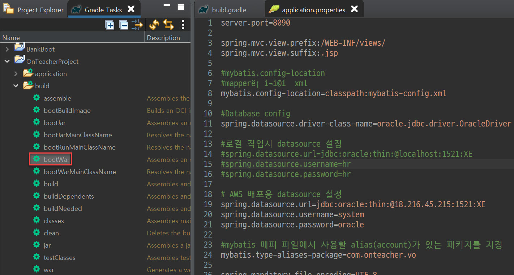

# OnTeacher Deploy Guide  


## STS 4 bootWar 생성하기

1. build.gradle에서 **ojdc6**대신에 **ojdc10**을 추가합니다.

   > ojdbc6은 AWS에서 충돌을 일으키는 증상이 발견되었습니다. 

   ``` java
   dependencies 
   {
       ...
       ll
           
   	...
   }
   ```
   
   


2. 로컬에서 실습하는 환경이 아닌 실제 호스팅 환경이므로 Application.properties 에서 IP, Username, Password를 변경합니다.

   ```java
   spring.datasource.url=jdbc:oracle:thin:@18.216.45.215:1521:XE "AWS 공인 IP 주소"
   spring.datasource.username=system
   spring.datasource.password=oracle
   
   

3. 상단 메뉴에서  Window > Other > Gradle Tasks를 선택하여,  Project Explorer 옆에 Gradle Tasks 메뉴를 화면에 표시합니다. 

4. Gradle Tasks  메뉴에서 Build할 프로젝트를 선택한 후 build > bootWar를 선택하여 war 파일을 생성합니다. 

   

   > war  파일은 OnTeacherProject\build\libs\에 .war로 생성됩니다. 


## GitHub Desktop를 이용하여  war 파일 업로드하기 

1. GitHub Desktop을 설치한 후  배포로 사용할 Repository를 생성합니다. 

2. 생성한 Local Repository 에 실행할 war 파일을 복사합니다. 

   > 본 예제에서는 OnTeacherProject-0.0.1-SNAPSHOT.WAR을 사용합니다. 

   

3. Commit to master 를 클릭한 후에 publish repository를 클릭합니다. 

   

4.  정상적으로 업로드 되면, Github repository에 빌드한 war 파일이 업로드 됩니다. 

   

   > 배포서버 git clone 할 예정이오니, clone 할  HTTPS 주소를 복사해 둡니다. 
   >
   > https://github.com/KhanKMS/OnTeacher-Deploy.git


## AWS EC2 ubuntu Linux 접속하기 

* AWS EC2 :  **Amazon Web Service Elastic  Compute Cloud**. 자체 서버를 구축하지 않고(On Premise Model), AWS가 운영하는 퍼블릭 클라우드(Public Cloud)에 접속하여 가상화된 서버를 이용하는 서비스. 

* AWS EC2에 접속하기 위해서는 SSH 클라이언트 도구를 이용해야 함 :  **putty**, **MobaXterm** 

* 본 가이드에서는 UI/UX 기능이 대폭 강화된 **MobaXTerm Home Edition**을 사용함. 

* 본 프로젝트에서는  ubuntu Linux와  Docker 컨테이너 기술을 이용하여 웹 애플리케이션을 배포함. 

  > 사용하는 ubuntu Linux  버전 :  **ubuntu 18.04.5 LTS**
  
  

##   MobaXtem을 이용한 ubuntu Linux 접속 절차 
1. MobaXterm 에 접속한 후 Personal Edtn을 다운로드 합니다. 

   > https://mobaxterm.mobatek.net/download.html

2. MobaXterm을 실행 후 sessions > Putty sessions에 오른쪽 클릭 후 New Session 을 선택합니다. 

3. Session settings 창에서  SSH를 선택합니다. 

4. Session settings > Basic SSH settings 창에 아래와 같은 정보를 입력합니다. 

| 구분             | 설명          |
| :--------------- | ------------- |
| Remote host      | 18.216.45.215 |
| Specify username | ubuntu        |
| Port             | 22            |


5. Advanced SSH setting 창에 **Use private key** 를 체크하고, 발급 받은 개인키(**ai02.pem**)를 연결합니다. 

   > 본 가이드의 AI02.PEM은 리얼 서버 용이고, 자신의 테스트 서버로 접속하는 경우에는  AWS 에서 다른 키를 다운로드하여 연결해야 합니다. 
   >
   > 공개키 암호화 알고리즘에서 사용하는 개인에게만 할당된 키로서, 개인키를 발급하지 않았다면 콘솔에 접속할 수 없습니다. 개인키가 없다면 시스템 관리자에게 요청하시기 바랍니다. 


6.  AWS EC2 ubuntu Linux에 정상적으로 접속한 후 기본적인 정보를 확인합니다. 

   ```bash 
   $ cat /etc/issue "ubuntu  버전 확인" 
   $ whoami "터미널 접속 계정 이름 확인"
   $ df -f "디스크 공간 확인"
   ```
   
   > Real AWS  서버(접속 IP : 18.216.45.215)는 실제 호스팅하는 서버이므로, 스킬 업을 위한 실습은 별도의  AWS 계정을 이용해서 진행해야 합니다.  


## Docker 설치 절차

1. ubuntu 리눅스 최신 기능 업데이트를 적용합니다. 

   ```bash 
   $ sudo apt update
   ```

2. Docker 설치에 필요한 유틸리티 프로그램을 설치합니다. 

   ```bash 
   $ sudo apt install apt-transport-https
   $ sudo apt install ca-certificates
   $ sudo apt install curl
   $ sudo apt install software-properties-common
   ```

3. curl을 이용해서 docker를 설치합니다. 

   ``` bash
   $ sudo curl -fsSL https://download.docker.com/linux/ubuntu/gpg | sudo apt-key add -
   ```

4. ubuntu bionic  배포판 저장소(Repository)를 설정합니다. 

   ```bash
   $ sudo add-apt-repository "deb [arch=amd64] https://download.docker.com/linux/ubuntu bionic stable"
   ```

5. ubuntu 리눅스 최선 기능 업데이트를 다시 한번 적용합니다. 

   ```bash 
   $ sudo apt update
   ```

6. Docker를 다운로드하고 설치합니다. 

   ```bash 
   $ sudo apt-cache policy docker-ce
   $ sudo su 								"Docker 설치를 위해서 root 권한으로 상승합니다."
   # apt install docker-ce 				"프롬프트가 #(root) 변경되었음."
   ```

   > 리눅스에서 프로그램 설치 , 서비스 설정 시 권한 관련 에러가 표시되면 권한을 root 로 상승시킨 후 시도해보면 많은 문제가 해결됨. 

7. Docker가  System Service에 등록되며, 아래 명령으로  Docker version을 확인 가능합니다. 

   ```bash
   $ sudo docker version
   ```

   


## Git 설치 절차 

1. git을 apt 커맨드로 설치합니다. 

   ``` bash 
   $ sudo apt install git 
   ```

2. git이 정상적으로 설치되었는지 version을 확인합니다. 

   ``` bash 
   $ sudo git --version 
   ```

   


## Oracle  설치 절차 

1. Oracle DB엔진을 아래의 명령을 이용해서 설치합니다. 

   ```BASH
   $ sudo docker run -d --name oracle -p 1521:1521 -p 48080:8080 -v ~/0jes/oracle_db:/opt/oracle/oradata deepdiver/docker-oracle-xe-11g
   ```

   |  옵션  | 설명                                                         |
   | :----: | ------------------------------------------------------------ |
   |   -d   | Daemon으로 만들어줌. Background로 실행하도록 함.             |
   |   -p   | Port  Forwarding 을 수행함.                                  |
   | --name | Docker 컨테이너 이름을 지정해줍니다. 위 예제에서는 oracle이라고 명명했습니다. |

   

   > Docker  내부 정책으로 docker 무료 사용자의 경우 ip 기반으로 다운로드를 제한할수도 있습니다. 이런 증상이 생길 경우에는 aws ubuntu linux ip 변경을 위해서 인스턴스를 중지 후 재기동해 봅니다. 
   >
   >  AWS Instance는 서비스 중지 후 새로운 ip 를 할당 받기 때문에, 고정 IP(elastic IP)를 할당받지 않았다면 IP가 변경됩니다. 

2. 설치 및 테스트를 용이하기 위해서 sudo su 명령으로 root  권한을 가져옵니다. 

   ```bash
   $ sudo su 
   # (root 권한 상승 시 프롬프트가 #으로 변경됩니다.)
   ```

3. oracle 도커 이미지의 #container id를 확인합니다. 

   ```bash 
   # docker ps -a 
   ```

   

   > STATUS		Up 27 minutes		27 분 동안 ORACLE  서비스가 백그라운드에서 실행하고 있다는 의미
   >
   > CONTAINER  ID		Docker Image를 호출하는 데 사용하는 유니크 값 	예시) 2aa62d90d2f6

4. oracle   도커 이미지가 중단되어 있다면 아래의 명령으로 실행하여 줍니다. 

   ```bash
   # docker start {CONTAINER ID}
   # docker start 2aa62d90d2f6 		"Docker image를 시작합니다."
   # docker stop 2aa62d90d2f6			"Docker image를 중단합니다."
   ```

5. oracle  이미지를 실행 한 후 sqlplus Shell로 이동합니다. sqlplus  shell이 실행되면, user-name, password를 입력하여 로그온 합니다. 

   ```bash 
   # docker exec -it 2aa62d90d2f6 /bin/bash 
   
   root@7df740aeb0a5:/# sqlplus
   
   SQL*Plus: Release 11.2.0.2.0 Production on Wed May 5 03:54:29 2021
   Copyright (c) 1982, 2011, Oracle.  All rights reserved.
   
   user-name : system 
   password : oracle
   
   Connected to:
   Oracle Database 11g Express Edition Release 11.2.0.2.0 - 64bit Production
   SQL> 
   ```

6. oracle sql 문 입력을 위해서  sql developer를 아래와 같이 설정한 후 접속하면, 원격으로  sql 관리 작업을 수행할 수 있습니다. 

   

   > 사용자 이름 : system 
   >
   >  비밀번호 :  oracle
   >
   >  호스트 이름 : AWS 접속 IP를 입력함

7. SQL Developer 에서 ORACLE AWS 를 선택한 후 테이블 생성 쿼리를 실행합니다. 프로젝트에 관련된 모든  SQL TABLE 작성 쿼리를 실행해야 합니다. 

   

   

   ## Docker Web Applicatin 빌드하기 

   1. AWS ubuntu에 접속한 후 Web Application을 다운 받을 디렉토리를 생성합니다. 

      ```bash 
      # mkidr ~/app&&mkdir ~/app/step2
      # cd ~/app/step2
      ```

      > step2 디렉터리가 이미 생성되어 있다면, step3으로 생성하면 됩니다. 

   2. 미리 war 파일을 저장해둔 git repository에서 빌드할 파일을 다운로드 합니다.

      ```bash
      # git clone https://github.com/KhanKMS/OnTeacher-Deploy.git
      ```

      > 본 가이드에서는 작성자가 생성한 git  Repository를 사용했습니다만, 자신의 git Repository가 있다면 해당 github URL을 입력합니다. 

      

   3. 클론한 디렉토리로 이동합니다. 

      ```bash
      # cd OnTeacher-Deploy 			"git clone한 디렉토리를 지정함"
      ```

   4. Dockerfile  Linux vi 에디터를 이용해서 아래와 같이 작성합니다. 

      ~~~ bash 
      # vi Dockerfile
      ~~~
   
      ```bash 
      FROM openjdk:11-jdk as builder
      ARG JAR_FILE=./OnTeacherProject-0.0.1-SNAPSHOT.war
      COPY ${JAR_FILE} app.war
      
      ENV TZ=Asia/Seoul
      RUN ln -snf /usr/share/zoneinfo/$TZ /etc/localtime && echo $TZ > /etc/timezone
      
      ENTRYPOINT ["java","-jar","app.war"]
      ```

      > linux vi 에디터 데이터 저장은 Esc 키 누른 후 :wq를 입력하면 됩니다. 
      >
      > linux vi 에디터 사용법은 관련 도서, 웹 사이트를 참고하시면 됩니다.
   
   5. Docker 파일을 빌드합니다. 

      ``` bash 
      # docker build -t onteacher .                
      ```

      > **.**를 누락하는 경우가 많습니다. "."의 의미는 리눅스에서 현재 파일 경로를 의미합니다.  
   
   6. Docker 이미지를 실행합니다. 

      ```bash 
      # docker run -p 8090:8090 onteacher
      ```
   
   7. 아래와 같이 URL을 웹 브라우저에 입력하여, 웹 애플리케이션을 실행합니다. 
   
      ``` WEB
      HTTP://{AWS public ip}:{port 번호} / 
      ex) http://18.216.45.215:8090/main
      ```
   
      > 실행중인 Docker Web Application 을 중단하려면 Ctrl+C를 눌려주세요. 
   
       

