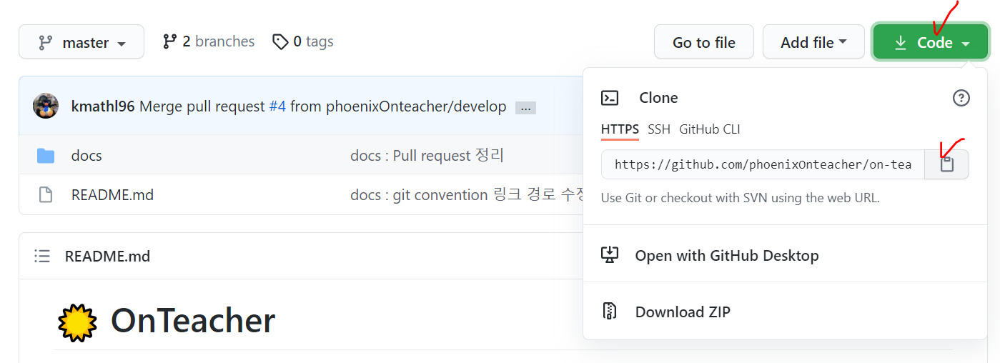
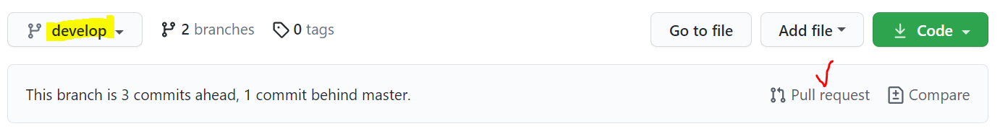
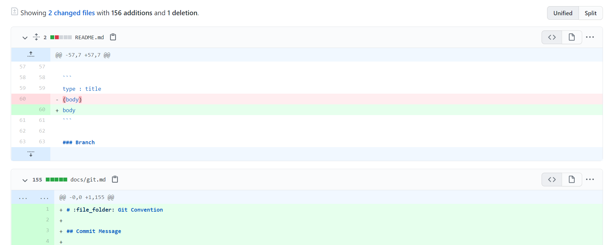
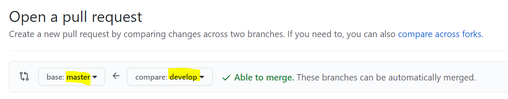
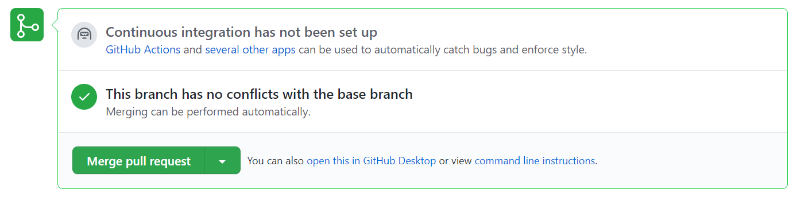
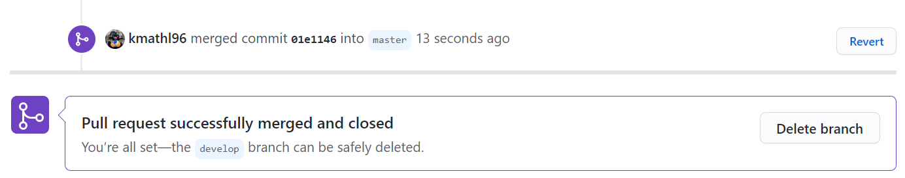

# :file_folder: Git Convention

## Commit Message

> commit message는 이렇게 남겨요

```
type : title
body
```

1. **Type**

   - `feat` : 새로운 기능 추가
   - `fix` : 버그 수정
   - `refactor` : 코드 리팩토링
     - 코드 개선 (가독성 높이고 유지보수 편하게 함)
     - 결과 변경 X
   - `style` : 코드 형식, 정렬, 주석 등의 변경
     - 동작에 영향을 주는 코드 변경 X
   - `test` : 테스트 추가, 테스트 리팩토링
   - `docs` : 문서 수정
   - `chore` : 기타; 빌드 업무 수정, 패키지 매니저 설정 등 위에 해당되지 않는 모든 변경 사항

2. **Title**

   - 끝에 `.` 금지

   - 영어로 작성할 때에는 `명령조`&`대문자`로 시작

     ```
     Upload README.md
     Update ERD.png
     ```

3. **Body**

   - 생략 가능

   - type, title 쓰고 한 줄 띄운 후 작성

     - 따옴표 안 닫고 엔터 치면 줄바꿈됨

       ```bash
       $ git commit -m "type : title
         body1
         body2"
       ```
   
   
   - `어떻게` 보다는 `무엇을`, `왜` 변경하였는지 설명
   

:eyes: 참고 사이트

- [Udacity Git Commit Message Style Guide](https://udacity.github.io/git-styleguide/)
- [NHN Cloud Meetup : 좋은 git 커밋 메시지를 작성하기 위한 7가지 약속](https://meetup.toast.com/posts/106)

## Git Branch

> 팀원들은 기능마다 브랜치를 만들어 작업합니다

- `master` : 오류 없는, 배포 가능한 상태
- `develop` : 개발 중
- `feature/XXX` : XXX 기능 개발 중

팀원들은 기능마다 `feature/XXX` 브랜치를 생성하며, 기능 이름 XXX는 Camel Case를 사용해요. 개발 후 **해당 브랜치에 푸시**합니다. 에러 없이 제대로 실행되는지 확인하고, `develop` 브랜치에 머지하여 반영합니다(Github에서 [Pull request](#Pull-request)로 처리). 머지할 때 팀원들에게 알리고, 다른 팀원들은 pull 받아 최신 상태에서 개발하도록 합니다. 기능 개발이 완료되면, 해당 브랜치는 삭제합니다.

문서 작업은 develop 브랜치에서 하셔도 괜찮습니다.

배포 전, develop 브랜치를 master 브랜치에 머지합니다. 팀원이 master에서 작업하는 일은 없어야 합니다. 개발 시 자신의 브랜치을 확인해 주세요. :exclamation:

### 명령어

1. 브랜치 생성

   ```bash
   $ git branch (브랜치 이름)
   ```

2. 브랜치 변경

   - 해당 브랜치로 이동

     ```bash
     $ git checkout (브랜치 이름)
     ```

   - 브랜치 생성하고 바로 이동

     ```bash
     $ git checkout -b (브랜치 이름)
     ```

3. 브랜치 삭제

   ```bash
   $ git branch -d (브랜치 이름)
   ```

4. 브랜치 목록 확인

   ```bash
   $ git branch -a
   ```


## Git 명령어

> Git 관련 명령어를 정리했습니다
>
> 팀원들은 변경 사항을 Git에 반영하기 전에, 아래 내용을 꼭 확인해 주세요

1. **Pull**

   ```bash
   $ git pull origin develop
   ```

   - develop의 파일들을 내려받아 최신의 상태 유지
   - 개발 중인 코드가 사라지는 것을 방지하기 위해, 본인이 수정한 파일 코드를 다른 데에 옮겨둔 후 pull 받을 것

2. **Status**

   ```bash
   $ git status
   ```

   - 자신의 브랜치에서의 변경 사항과 상태를 확인할 수 있음
   
3. **Add**

   ```bash
   $ git add (본인이 수정한 파일)
   ```

   - 반드시 **본인이 수정한 파일만** add할 것

   - add 하기 전에 pull 받아, 최신 파일에 자신의 코드를 반영시킬 것

   - status로 변경 사항 확인 후 add 권장

   - 여러 파일 동시에 add 가능

     ```bash
     $ git add (파일1) (파일2) (파일3)
     ```

4. **Commit**

   ```bash
   $ git commit -m "(커밋 메시지)"
   ```

   - 위의 [Commit message convention](#Commit-Message)을 지킬 것
   - 최대한 나눠서 커밋 권장
   - 날짜는 깃에 기록되니 넣지 않아요

5. **Push**

   ```bash
   $ git push origin (자신의 브랜치)
   ```

   - 자신의 브랜치에 수정 사항을 반영시키는 작업
   - 반드시 자신의 브랜치에 푸시할 것 :exclamation:

6. **Merge**

   ```bash
   $ git merge (브랜치 이름)
   ```

   - 문제 없이 잘 실행되는지 확인한 후, `develop` 브랜치에 머지할 것
   - 위의 명령어를 사용하기보다는 Github에서 [Pull request](#Pull-request)로 처리 권장

7. **Clone**

   1. git 저장소(repository)를 복제할 폴더로 이동

      - 그 폴더는 git 저장소가 아니어야 함 (폴더 내에 `.git` 파일이 있으면 해당 폴더는 git 저장소이므로, 그 상위폴더나 다른 폴더에서 클론 하셔야 돼요)

   2. git bash를 열어 명령어 입력

      ```bash
      $ git clone (깃 저장소 url)
      ```

      - 저장소 url은 해당 프로젝트 페이지에서 복사할 수 있습니다
        
      - 우리 프로젝트 url : https://github.com/phoenixOnteacher/on-teacher.git
      - bash에서는 `Shift + Insert` 하시면 붙여넣기 돼요! :honey_pot:

   3. 복제 완료

      - 해당 repository 폴더가 생기고, master 상태의 코드가 받아집니다

   4. 개발 시작

      1. 본인 브랜치 생성 및 이동

         ```bash
         $ git checkout -b (브랜치 이름)
         ```

         - [브랜치 이름](#Git-Branch)은 아마 `feature-기능 이름`이 될 거예요

      2. develop의 파일 받기

         ```bash
         $ git pull origin develop
         ```

      3. 고생 많으셨습니다! 이제 개발 진행하시면 돼요 :slightly_smiling_face:

## Pull request

1. push 하고나서, Github의 프로젝트에서 해당 브랜치를 선택하면 `Pull request` 버튼이 생김

   

   - `Compare` 버튼을 누르면 변경 전후 비교 가능
     

2. Pull request 관련 설정

   

   - 반드시 **base를 develop** 브랜치로 설정 :exclamation:
   - title, comment 등은 자유롭게 작성

3. 충돌 여부 확인 후 머지
   

   - `Merge pull request`버튼 누르고 `Confirm하여 머지
   - 충돌 발생 시, 코드를 비교하여 수동으로 머지

4. 머지 완료 및 브랜치 삭제
   

   - 머지가 완료되면, 해당 브랜치를 Github에서 바로 삭제할 수 있음 (필수 아님)

